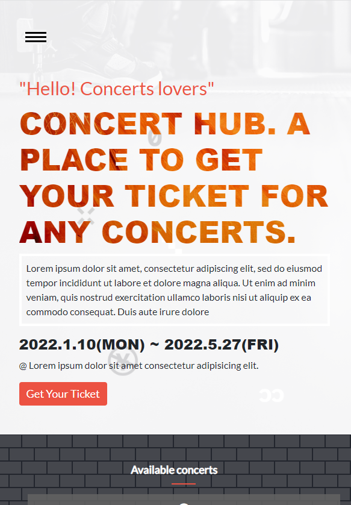
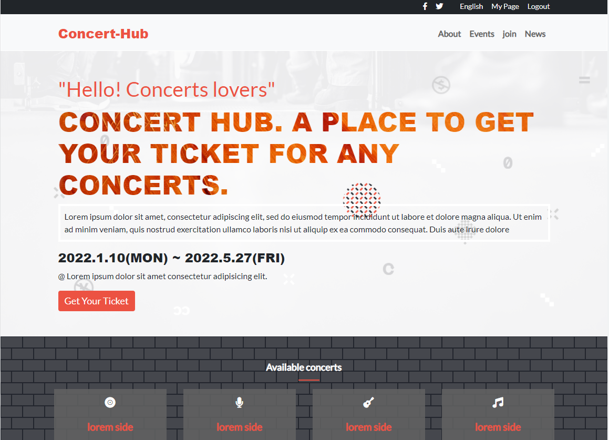

# ConcertHub

This is my final project for HTML & CSS MODULE ONE from the microverse curriculum.

This is a mobile version of my portfolio.

This project is meant to test student ability's on being able to put together all that they have learnt in a module to ensure they mastered it well.

## Built With

- HTML
- CSS
- JAVASCRIPT
- Bootstrap

## Live Demo

[Live Demo Link](https://abdollahraafat.github.io/ConcertHub/)

## Get a copy

- Prepare a local directory. 
- Open terminal.
- Clone this project by the command `git clone URL/repository_name.git`.
- Open `index.html` in your local browser.

## Author

- GitHub: [AbdollahRaafat](https://github.com/AbdollahRaafat)
- LinkedIn: [AbdollahRaafat](https://www.linkedin.com/in/abdollah-raafat-886059221/)

## Credits

- The original design ideal by [Cindy Shin in Behance](https://www.behance.net/adagio07)
- Project from [Microverse](https://bit.ly/MicroverseTN) html & css module

## Acknowledgments

- Microverse

## 📝 License

This project is [MIT](./MIT.md) licensed.
